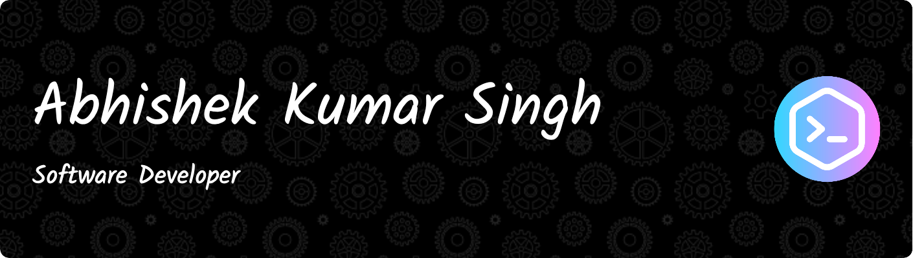

# 


## Hey there, I'm <span style="font-size:1em;color: #009999">Abhishek Kumar Singh</span> 👋

[](www.linkedin.com/in/er-abhishek-kumar-singh)&nbsp;&nbsp;
[](https://github.com/erabhisheksingh/)

---

👨‍💻 &nbsp;I'm a Software Developer currently working as **IT Engineer** based out of Amsterdam, Netherlands.\
💡 &nbsp;I'm involved in developing Cloud Native Applications.\
🎓 &nbsp;I'm a passionate Java and SpringBoot developer and fully endorse the Open Source community.\
🌱 &nbsp;Actively looking for Open Source projects to contribute.\
✍️ &nbsp;In my free time, I like reading novels and trekking.\
💬 &nbsp;Feel free to reach out to me for consulting or just for some interesting discussion.

###  Wanna know more...  

```python
def abhishek():
    pronouns = "He | Him"
    code = ["Java", "Python", "Golang"]
    technologies = {
        "BackEnd": {
            "Java" : ["SpringCloud", "SpringBoot", "Spring-Security"],
            "Python" : ["FastAPI"],
            "Go" : ["gorilla/mux"]
        },
        "Frontend" : ["Javascript", "HTML", "CSS"],
        "Cloud Technologies" : ["AWS", "Azure services", "Docker🐳", "Kubernetes"],
        "Databases" : ["MariaDB", "MySql", "H2", "Oracle", "MSSql"],
    }
    currentFocus = "Learning Azure"
```

This year I'll focus on learning **Azure**. I also started to test the waters of **Golang** and it's ecosystem. Created a few projects using **FastAPI** and **Gorilla/Mux** and will be creating a few more. Hopefully by the end of the year will have good Golang skills too.

If you find any of my Public projects as useful, feel free to **Fork**.

---
### 🔧 &nbsp;Languages & Frameworks

&nbsp;
&nbsp;
&nbsp;
&nbsp;
&nbsp;
&nbsp;
&nbsp;
&nbsp;
&nbsp;
&nbsp;
&nbsp;
&nbsp;
&nbsp;
&nbsp;
&nbsp;
&nbsp;
&nbsp;
&nbsp;
&nbsp;

---

### 🗃 &nbsp;Databases

&nbsp;
&nbsp;
&nbsp;
&nbsp;
&nbsp;
&nbsp;

---

### 🧰 &nbsp;Other Tools

&nbsp;
&nbsp;
&nbsp;
&nbsp;
&nbsp;

&nbsp;
&nbsp;
&nbsp;
&nbsp;
&nbsp;
&nbsp;
&nbsp;

---
### 💻 &nbsp;GitHub Stats

---

<p align="center">
    <a href="https://github.com/erabhisheksingh/">
        
    </a>
    <a href="https://github.com/erabhisheksingh/">
        
    </a>&nbsp;&nbsp;
<p align="center">
    <a>
        
    </a>
</p>

### 🐍 &nbsp;That's How Commits move ...

<div align="center">
  <a href="https://github.com/erabhisheksingh/">
  </a>
</div>


